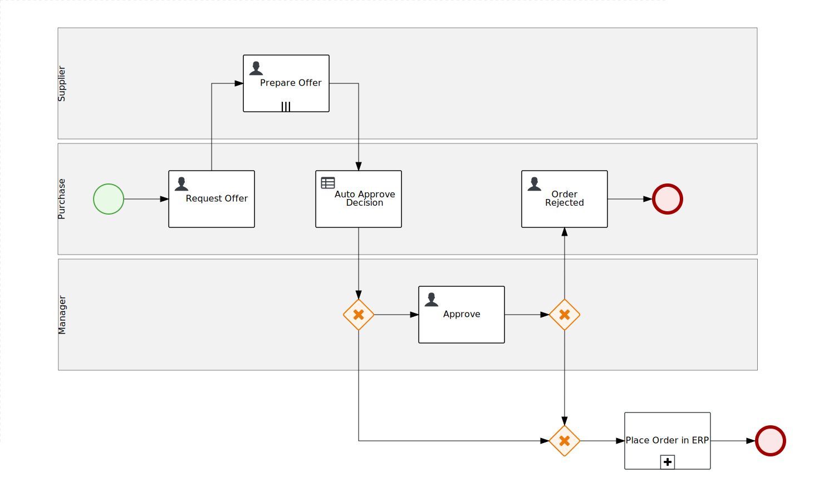
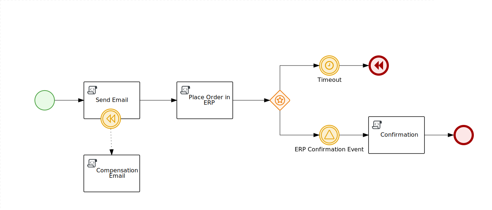
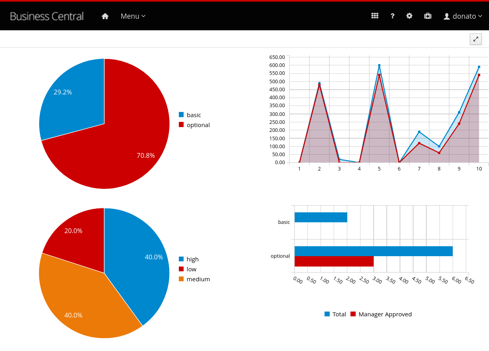
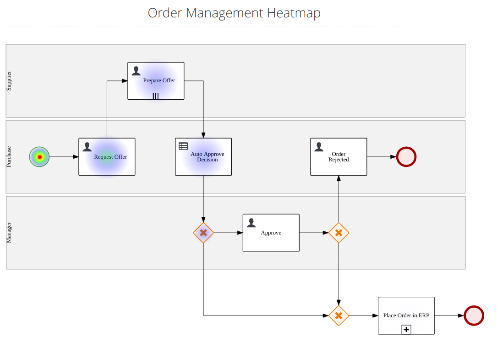

Red Hat Process Automation Manager - Order Management Demo Repository
=====================================================================


**Red Hat Process Automation Manager** is the Business Process Management product from Red Hat, based on the open source project [jBPM](http://www.jbpm.org).

This demo aims to show some of the core capabilities of this powerful product.

Order Management Process
-----------------------------------

Any organization has a procurement process similar to this one: 

  - the process is started by an employee requiring a business asset (i.e. a phone, a laptop, etc)
  - the purchase department engages a set of suppliers to get the best offer (`Request Offer` task)
  - suppliers provides their best offer (`Prepare Offer` task)
  - the cheapest offer is selected
  - the offer can be automatically accepted whether a set of *Business Rules* are met (implemented by a DMN decision `Auto Approve Decision`)
  - whether the offer does not satisfy the Business Rules, a manager is involved for the final decision (`Approve` task)
  - finally the order is finalized calling the sub-process `Place Order in ERP` or is rejected and passed back to the purchase department for acknowledgement (`Order Rejected` task)

In the following picture the BPMN process design:



Place Order in ERP sub-process
-----------------------------------

This sub-process aims to simulate an asynchronous integration with an external system and to demonstrate the compensation capabilities of the process engine:

- the first task send an email to alert that the order is sent to the ERP system
- the task `Place Order in ERP` send the order to the ERP using an asynchronous messaging system (e.g. Kafka, JMS, MQTT, etc.)
- the event gateway have to possible exit condition:

  - timer event: if no other event arrives in 30 seconds complete the process with a **compensation**.
  - signal event: it waits for a confirmation message from the ERP system that the order is correctly processed, the signal name is by convention `erp-<process instance id>`.

- the task `compensation email` is executed if the time out event is fired and the compensation is raised.  



How to deploy this demo project
-----------------------------------

Import the This repository can be imported in your Business Central following these steps:

  1. From Home page *click* **Design**
  2. In header section where is the space name (e.g. myteam) *select the kebab icon* (the 3 vertical dots icon)
  3. *Select* **Import Project**
  4. *Fill the* **Repository URL** field with this github repository URL (`https://github.com/jbossdemocentral/rhpam7-order-management-demo-repo.git`)
  5. Select *Order Management* and click **Ok**

**WARNING** This demo persists the `OrderInfo` data object through JPA. Since the same data object is used in web forms, in order to properly render those forms it's necessary to explicitly enable those classes with the following *system property*: 

```xml
<property name="org.kie.server.xstream.enabled.packages" value="org.drools.persistence.jpa.marshaller.*"/>
```

In order to configure the persistence make sure that the following property is set to an accessible datasource in the application server configuration. (OpenShift Operator sets it up autonomously) 

```xml
<property name="org.kie.server.persistence.ds" value="java:jboss/datasources/ExampleDS"/>
```

In order to deploy it in OpenShift, here the Operator configuration (`KieApp` yaml file): 

```yaml
spec:
  commonConfig:
    adminPassword: changeme
  environment: rhpam-trial
  objects:
    console:
      jvm:
        javaOptsAppend: >-
          -Dorg.kie.server.xstream.enabled.packages=org.drools.persistence.jpa.marshaller.*
          -Ddashbuilder.kieserver.serverTemplate.default-kieserver.replace_query=true
      replicas: 1
    servers:
      - database:
          type: h2
        id: default-kieserver
        jvm:
          javaOptsAppend: >-
            -Dorg.kie.server.xstream.enabled.packages=org.drools.persistence.jpa.marshaller.*
        replicas: 1
```

Run the demo process
-----------------------------------

1. An employee create an order for a required item. To start the process, s/he has to select the *item name* and the *urgency*.

  - Click **Diagram** to show the BPMN diagram of the process instance just started (BPMN is the well known notation to describe business processes where Business Analysts and Developers can share a common view). In this picture, the business stakeholder can recognize the process where s/he is involved in and get visibility on it.
  - From the **Menu** bar, select the **Process instances**: users can understand and search process instances and easily investigate the status.

2. Open **Track > Task Inbox**, there is the task **Request Offer** that wait for the *purchase expert* action.

  - On the top right of the task list, there is an icon to show more information about the tasks, click **Description**
  - From the kebab menu select **Claim and Work**. In the task view, click **Start**
  - Select a **category** for the order, a **target price**, the **suppliers list** who will be asked to provide an offer.
  - Click **Complete**

3. Now, it's the turn of the suppliers to carry on the **Prepare Offer** task. In the list, there is a task for each supplier selected at previous step. The task description point out for which supplier is the task: e.g. `supplier1 prepares offer for Laptop Dell XPS 15`

  - For each task, select **Claim and Work** and in the task view, click **Start**.
  - The supplier has to define a **delivery date** and the **best offer**
  - **Notice:** by design, if the offer match the target price or is lower, other suppliers will not be able to provide their offer (the other tasks are exited)

4. If there are no other tasks for that process instance, the process is completed. In fact, the next task is the *Auto Approve Decision*: it calls a DMN logic that based on the order features decides whether a manager approval is required to confirm the order.

  - if the process instance is completed: open the process instances list
  - in the filter pane, select **Completed** to show the completed instances
  - select the completed instance and check the process history opening the diagram.

5. If a manager is involved, s/he has to take charge of the *Approve* task, where s/he can approve or reject the order providing a motive.

6. If the manager rejects the order, the purchase expert receives the *Order Reject* task to acknowledge the order rejection reason.

7. The *process happy path* completes approving the order and send the order information to the **ERP system** to finalize the order.

### Before the demo

- in order to create a list of running instances that make the demo more realistic. Start **OM-demo-init** process, do not change any value in the form.

Dashboard Example
-----------------------------------

It's available a sample dashboard that shows some charts related to the order management business context.

Follow this steps to import the dashboard:

1. In Business Central, **select** the `Admin` page (the gear icon on the top right position)
2. Scroll down to **select** the `Dashbuilder Data Transfer` tile
3. In the `Import` pane select the file `dashboard/order-management-dashbuilder.zip` in the current project
4. **Click** the `Import` button

In the **Track** section of the top **Menu**, there are two new pages available:

1. **Order Reports** shows a set of charts displaying some _Key Performance Indicators_ of the process like in the following screen shot:

   

2. **Heatmap** shows the process diagram, where the tasks are blanket with a cloud which color intensity highlights how often the task is triggered. This is a precious visualization technique for the Business Analyst who can easily spot which area of the process is more stressed.

      

It is worth mentioning that RHPAM offers many extensions point, so it can be observed in a multiplicity of ways. For example, it can leverage the **elastic search** technology, as detailed in the following article:

[Monitor business metrics with Red Hat Process Automation Manager, Elasticsearch, and Kibana](https://developers.redhat.com/blog/2020/05/04/monitor-business-metrics-with-red-hat-process-automation-manager-elasticsearch-and-kibana/)

Task Assignment
-----------------------------------

All the task are assigned to the group `kie-server` in order to easily deploy the demo in OpenShift Container Platform.
If in your environment, you have multiple users and roles you can change the assignment accordingly.

- Task: **Request Offer** - User Group: `kie-server`
- Task: **Prepare Offer** - User Group: `kie-server`, this task is supposed to be assigned dynamically to the suppliers selected at previous task (*Request Offer*). If in your environment you can define these users: supplier1, supplier2, supplier3, then you can remove the group and assign the actor to `#{supplier}`
- Task: **Approve** - User Group: `kie-server`
- Task: **OrderRejected** - User Group: `kie-server` 


Change Log
-----------------------------------

- Version 7.12.1
  - Enhanced ERP Integration Process

- Version 7.12

- Version 7.11.1
  - Improved OpenShift deployment support

- Version 7.11 (RHPAM v7.11)
  - Heatmap

- Version 7.9 (PAM version 7.9):
  - timer reduced to 2 minutes

- Version 7.7 (PAM version 7.7):
  - test scenarios
  - process clean up
  - improved demo launcher 
  - version update
  - documentation includes the configuration tweak to manage the correct form rendering 
  - ERP integration sub-process to show the compensation capability

- Version 7.6 (PAM version 7.6):
  - Dashboard
  - Fixes to **OM-demo-init**
  - Fixes to variable persistence logic

- Version 7.4 (PAM version 7.4): 
  - Version 7.4.1 update, task normalization, version update and documentation
  - Version 7.4 update

- Version 7.3 (PAM version 7.3):
  - Version 7.3 multiple suppliers in parallel, DMN decision, demo initialization process

- Version 7.0 (PAM version 7.0):
  - 2019-03-15: process description with order item
  - 2019-03-13: documentation improved
  - 2019-01-29: changed user group to match existing one in OCP standard image.

TODO
-----------------------------------

- documents
- error handling
